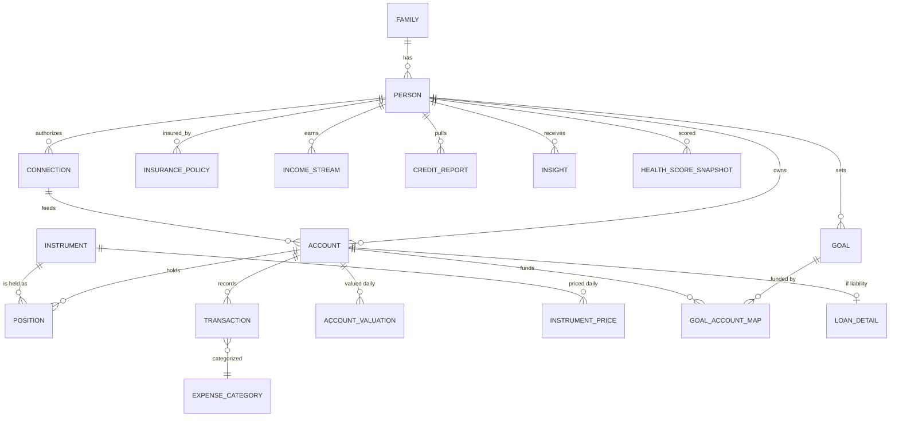

# PFOS — Financial Data Model & Database Schema

> Deliverable 4 (Database Schema) + the data foundation for Steps 2, 4, 5.
> Target: PostgreSQL 16 + TimescaleDB extension for time-series; Redis for hot caches.

---

## 1. Modeling Principles

1. **Everything is an Account holding Positions in Instruments.** A mutual fund folio, a demat account, a home loan, a house, and an ESOP grant are all `accounts` with one or more `positions`. This single abstraction lets the net-worth engine, allocation engine, and projection engine treat all wealth uniformly.
2. **Liabilities are negative-value accounts.** Same tables, `account_class = 'liability'`. No parallel schema to keep in sync.
3. **Immutable transaction ledger, derived balances.** Transactions are append-only; positions and daily balances are derived and rebuildable. Corrections are reversal entries, never updates (audit + AA re-fetch idempotency).
4. **Bitemporal valuations.** Every valuation stores `as_of_date` (when it was true) and `recorded_at` (when we learned it). AA/MF Central data arrives late and gets restated; back-dated NAVs must not corrupt history.
5. **Source-linked provenance.** Every row that came from an external source carries `connection_id` + `external_id` + `data_quality`. Manual entries carry `source = 'manual'`. The UI always shows freshness.
6. **Multi-entity from day one.** `family` → `person` → `account`. Individual, couple, and family-office views are queries over the same structure, not features bolted on later.
7. **Money is `NUMERIC(20,4)` + currency code.** Never floats. Multi-currency with a daily FX table; base currency per family (default INR).

---

## 2. Entity Relationship Overview



---

## 3. Core Schema (DDL)

### 3.1 Identity & Family

```sql
CREATE TABLE family (
    id              UUID PRIMARY KEY DEFAULT gen_random_uuid(),
    name            TEXT NOT NULL,
    base_currency   CHAR(3) NOT NULL DEFAULT 'INR',
    plan_tier       TEXT NOT NULL DEFAULT 'free',     -- free | plus | premium | family_office
    created_at      TIMESTAMPTZ NOT NULL DEFAULT now()
);

CREATE TABLE person (
    id              UUID PRIMARY KEY DEFAULT gen_random_uuid(),
    family_id       UUID NOT NULL REFERENCES family(id),
    auth_user_id    TEXT UNIQUE,                       -- null for non-login members (children)
    role            TEXT NOT NULL DEFAULT 'owner',     -- owner | partner | member | viewer | advisor
    full_name       TEXT NOT NULL,
    date_of_birth   DATE,
    pan_token       TEXT,                              -- vault token, never raw PAN
    phone_token     TEXT,
    email           CITEXT,
    risk_profile    TEXT,                              -- conservative|moderate|aggressive (questionnaire)
    employment_type TEXT,                              -- salaried|business|professional|retired
    created_at      TIMESTAMPTZ NOT NULL DEFAULT now()
);
-- Row-Level Security on every user-data table, keyed by family_id.
```

### 3.2 Connections (Data Sources)

```sql
CREATE TYPE connection_provider AS ENUM (
  'aa_finvu','aa_onemoney','aa_camsfinserv','aa_saafe',
  'mf_central','cibil','experian','equifax','crif',
  'nsdl_cas','cdsl_cas','epfo','nps_cra',
  'broker_zerodha','broker_groww','broker_upstox','broker_angelone','broker_icici',
  'insurance_bima_central','gold_provider','manual','file_upload'
);

CREATE TABLE connection (
    id               UUID PRIMARY KEY DEFAULT gen_random_uuid(),
    person_id        UUID NOT NULL REFERENCES person(id),
    provider         connection_provider NOT NULL,
    status           TEXT NOT NULL DEFAULT 'pending',  -- pending|active|expired|revoked|error
    consent_handle   TEXT,                             -- AA consent handle / artefact id
    consent_expiry   TIMESTAMPTZ,
    fetch_frequency  TEXT NOT NULL DEFAULT 'daily',    -- realtime|daily|weekly|monthly|on_demand
    last_fetch_at    TIMESTAMPTZ,
    last_success_at  TIMESTAMPTZ,
    failure_count    INT NOT NULL DEFAULT 0,
    data_quality     SMALLINT,                         -- 0-100 computed per §7
    metadata         JSONB NOT NULL DEFAULT '{}',
    created_at       TIMESTAMPTZ NOT NULL DEFAULT now()
);
```

### 3.3 Instruments (the security master)

```sql
CREATE TYPE instrument_type AS ENUM (
  'mutual_fund','stock','etf','bond','reit','invit',
  'fd','rd','savings','ppf','epf','nps','sgb','digital_gold',
  'pms','aif','us_stock','us_etf','crypto',
  'real_estate','land','vehicle','gold_physical','jewellery','collectible',
  'esop','startup_equity','private_equity',
  'loan','credit_card','bnpl','overdraft','cash'
);

CREATE TABLE instrument (
    id              UUID PRIMARY KEY DEFAULT gen_random_uuid(),
    type            instrument_type NOT NULL,
    name            TEXT NOT NULL,
    -- identifiers (sparse; at least one for market instruments)
    isin            TEXT,
    amfi_code       TEXT,           -- mutual funds
    exchange_token  TEXT,           -- NSE/BSE scrip
    cusip           TEXT,           -- US securities
    currency        CHAR(3) NOT NULL DEFAULT 'INR',
    -- classification for allocation engine
    asset_class     TEXT NOT NULL,  -- equity|debt|gold|real_estate|cash|alternative|crypto|liability
    sub_class       TEXT,           -- large_cap|mid_cap|gilt|credit_risk|residential|...
    sector          TEXT,
    geography       TEXT NOT NULL DEFAULT 'IN',
    -- fund-specific
    expense_ratio   NUMERIC(6,4),
    fund_category   TEXT,           -- SEBI category for MFs
    benchmark       TEXT,
    metadata        JSONB NOT NULL DEFAULT '{}',
    UNIQUE NULLS NOT DISTINCT (isin, type)
);

-- Daily prices/NAVs. TimescaleDB hypertable.
CREATE TABLE instrument_price (
    instrument_id   UUID NOT NULL REFERENCES instrument(id),
    price_date      DATE NOT NULL,
    price           NUMERIC(20,6) NOT NULL,
    currency        CHAR(3) NOT NULL,
    source          TEXT NOT NULL,            -- amfi|nse|bse|vendor|manual
    recorded_at     TIMESTAMPTZ NOT NULL DEFAULT now(),
    PRIMARY KEY (instrument_id, price_date)
);
SELECT create_hypertable('instrument_price','price_date');

CREATE TABLE fx_rate (
    from_ccy CHAR(3), to_ccy CHAR(3), rate_date DATE,
    rate NUMERIC(20,8) NOT NULL,
    PRIMARY KEY (from_ccy,to_ccy,rate_date)
);
```

### 3.4 Accounts & Positions

```sql
CREATE TYPE account_class AS ENUM ('asset','liability');
CREATE TYPE account_type AS ENUM (
  -- financial assets
  'savings_account','current_account','fixed_deposit','recurring_deposit',
  'demat','mf_folio','ppf','epf','nps_tier1','nps_tier2',
  'pms','aif','us_brokerage','crypto_wallet','digital_gold','sgb_holding','cash_in_hand',
  -- physical
  'real_estate','land','vehicle','gold_jewellery','collectible',
  -- alternative
  'esop_grant','startup_investment','private_equity',
  -- liabilities
  'home_loan','car_loan','personal_loan','education_loan','business_loan',
  'gold_loan','loan_against_securities','credit_card','bnpl','overdraft'
);

CREATE TABLE account (
    id              UUID PRIMARY KEY DEFAULT gen_random_uuid(),
    person_id       UUID NOT NULL REFERENCES person(id),
    connection_id   UUID REFERENCES connection(id),    -- NULL = manual
    class           account_class NOT NULL,
    type            account_type NOT NULL,
    display_name    TEXT NOT NULL,
    institution     TEXT,                              -- HDFC Bank, Zerodha, LIC...
    external_id     TEXT,                              -- masked acct no / folio / UAN / PRAN
    ownership_pct   NUMERIC(5,2) NOT NULL DEFAULT 100, -- joint holdings
    is_active       BOOLEAN NOT NULL DEFAULT true,
    is_hidden       BOOLEAN NOT NULL DEFAULT false,    -- excluded from net worth on request
    opened_on       DATE,
    metadata        JSONB NOT NULL DEFAULT '{}',
    created_at      TIMESTAMPTZ NOT NULL DEFAULT now(),
    UNIQUE NULLS NOT DISTINCT (connection_id, external_id)
);

-- Current holdings within an account (one row per instrument per account)
CREATE TABLE position (
    id              UUID PRIMARY KEY DEFAULT gen_random_uuid(),
    account_id      UUID NOT NULL REFERENCES account(id),
    instrument_id   UUID NOT NULL REFERENCES instrument(id),
    quantity        NUMERIC(24,8) NOT NULL,            -- units/shares/grams; 1 for lumpy assets
    avg_cost        NUMERIC(20,6),                     -- per unit, base currency
    invested_amount NUMERIC(20,4),                     -- total cost basis
    as_of           TIMESTAMPTZ NOT NULL,
    UNIQUE (account_id, instrument_id)
);

-- Daily account-level valuation. The net-worth engine reads ONLY this table.
CREATE TABLE account_valuation (
    account_id      UUID NOT NULL REFERENCES account(id),
    as_of_date      DATE NOT NULL,
    value           NUMERIC(20,4) NOT NULL,            -- +ve assets, -ve liabilities
    invested        NUMERIC(20,4),
    currency        CHAR(3) NOT NULL DEFAULT 'INR',
    valuation_method TEXT NOT NULL,                    -- market|amortized|user_estimate|model
    confidence      SMALLINT NOT NULL DEFAULT 100,     -- physical assets < 100
    recorded_at     TIMESTAMPTZ NOT NULL DEFAULT now(),
    PRIMARY KEY (account_id, as_of_date)
);
SELECT create_hypertable('account_valuation','as_of_date');
```

### 3.5 Transactions & Cash Flow

```sql
CREATE TYPE txn_type AS ENUM (
  'buy','sell','dividend','interest','sip','swp','switch_in','switch_out',
  'deposit','withdrawal','transfer_in','transfer_out',
  'emi_principal','emi_interest','prepayment','disbursal','charge','fee','tax',
  'card_spend','card_payment','refund','salary_credit','rent_credit','reversal'
);

CREATE TABLE transaction (
    id              UUID PRIMARY KEY DEFAULT gen_random_uuid(),
    account_id      UUID NOT NULL REFERENCES account(id),
    instrument_id   UUID REFERENCES instrument(id),
    type            txn_type NOT NULL,
    txn_date        DATE NOT NULL,
    amount          NUMERIC(20,4) NOT NULL,            -- signed, account perspective
    quantity        NUMERIC(24,8),
    price           NUMERIC(20,6),
    currency        CHAR(3) NOT NULL DEFAULT 'INR',
    description     TEXT,                              -- raw narration
    merchant        TEXT,                              -- enriched
    category_id     UUID REFERENCES expense_category(id),
    category_source TEXT DEFAULT 'model',              -- model|rule|user (user wins, trains model)
    counterparty_account_id UUID REFERENCES account(id), -- internal-transfer detection
    external_id     TEXT,                              -- dedupe key from source
    reverses_txn_id UUID REFERENCES transaction(id),
    recorded_at     TIMESTAMPTZ NOT NULL DEFAULT now(),
    UNIQUE NULLS NOT DISTINCT (account_id, external_id)
);
SELECT create_hypertable('transaction','txn_date');
CREATE INDEX ON transaction (account_id, txn_date DESC);

CREATE TABLE expense_category (
    id         UUID PRIMARY KEY DEFAULT gen_random_uuid(),
    parent_id  UUID REFERENCES expense_category(id),
    name       TEXT NOT NULL,           -- Housing, Food, Transport, Travel, Entertainment,
    kind       TEXT NOT NULL,           -- expense | income | investment | transfer
    icon       TEXT,
    is_system  BOOLEAN NOT NULL DEFAULT true
);

CREATE TABLE income_stream (
    id            UUID PRIMARY KEY DEFAULT gen_random_uuid(),
    person_id     UUID NOT NULL REFERENCES person(id),
    type          TEXT NOT NULL,        -- salary|business|rental|dividend|interest|capital_gains|other
    source_name   TEXT,
    monthly_amount NUMERIC(20,4),
    growth_rate   NUMERIC(6,4) DEFAULT 0.07,   -- expected annual growth, used by projections
    is_active     BOOLEAN NOT NULL DEFAULT true,
    detected_from TEXT                  -- 'txn_pattern' | 'user'
);
```

### 3.6 Liability Detail & Amortization

```sql
CREATE TABLE loan_detail (
    account_id        UUID PRIMARY KEY REFERENCES account(id),
    principal         NUMERIC(20,4) NOT NULL,
    outstanding       NUMERIC(20,4) NOT NULL,
    interest_rate     NUMERIC(6,4) NOT NULL,         -- annual %
    rate_type         TEXT NOT NULL DEFAULT 'floating',
    emi               NUMERIC(20,4),
    emi_day           SMALLINT,
    start_date        DATE,
    end_date          DATE,
    remaining_months  INT,
    prepayment_penalty NUMERIC(6,4) DEFAULT 0,
    collateral_account_id UUID REFERENCES account(id) -- links home loan ↔ house
);

-- Generated amortization schedule (regenerated on rate/prepayment change)
CREATE TABLE amortization_row (
    account_id   UUID REFERENCES account(id),
    period_no    INT,
    due_date     DATE NOT NULL,
    emi          NUMERIC(20,4) NOT NULL,
    principal    NUMERIC(20,4) NOT NULL,
    interest     NUMERIC(20,4) NOT NULL,
    balance      NUMERIC(20,4) NOT NULL,
    PRIMARY KEY (account_id, period_no)
);

CREATE TABLE credit_card_detail (
    account_id        UUID PRIMARY KEY REFERENCES account(id),
    credit_limit      NUMERIC(20,4),
    current_outstanding NUMERIC(20,4),
    statement_day     SMALLINT,
    due_day           SMALLINT,
    apr               NUMERIC(6,4),
    reward_program    TEXT
);
```

### 3.7 Credit Bureau

```sql
CREATE TABLE credit_report (
    id            UUID PRIMARY KEY DEFAULT gen_random_uuid(),
    person_id     UUID NOT NULL REFERENCES person(id),
    bureau        TEXT NOT NULL,                  -- cibil|experian|equifax|crif
    score         SMALLINT,
    pulled_at     TIMESTAMPTZ NOT NULL,
    report_blob   JSONB NOT NULL,                 -- full normalized report
    utilization   NUMERIC(6,4),
    active_loans  INT,
    enquiries_6m  INT
);
```

### 3.8 Insurance

```sql
CREATE TABLE insurance_policy (
    id             UUID PRIMARY KEY DEFAULT gen_random_uuid(),
    person_id      UUID NOT NULL REFERENCES person(id),
    connection_id  UUID REFERENCES connection(id),
    type           TEXT NOT NULL,        -- term_life|endowment|ulip|health|motor|home|personal_accident
    insurer        TEXT,
    policy_no_token TEXT,
    sum_assured    NUMERIC(20,4),
    annual_premium NUMERIC(20,4),
    premium_due    DATE,
    start_date     DATE,
    maturity_date  DATE,
    surrender_value NUMERIC(20,4),       -- ULIP/endowment count toward net worth
    nominees       JSONB DEFAULT '[]',
    metadata       JSONB DEFAULT '{}'
);
```

### 3.9 ESOPs & Private Holdings

```sql
CREATE TABLE esop_grant (
    id              UUID PRIMARY KEY DEFAULT gen_random_uuid(),
    account_id      UUID NOT NULL REFERENCES account(id),
    company         TEXT NOT NULL,
    grant_date      DATE NOT NULL,
    total_options   NUMERIC(18,4) NOT NULL,
    strike_price    NUMERIC(20,6) NOT NULL,
    fmv_latest      NUMERIC(20,6),                -- latest 409A / valuation round
    fmv_confidence  SMALLINT DEFAULT 50,
    vesting_schedule JSONB NOT NULL,              -- [{date, options}] cliff + monthly
    vested          NUMERIC(18,4) DEFAULT 0,
    exercised       NUMERIC(18,4) DEFAULT 0
);
-- Valuation = vested × max(fmv − strike, 0) × haircut(illiquidity, default 30%)
```

### 3.10 Goals & Planning

```sql
CREATE TABLE goal (
    id               UUID PRIMARY KEY DEFAULT gen_random_uuid(),
    family_id        UUID NOT NULL REFERENCES family(id),
    type             TEXT NOT NULL,     -- retirement|fire|child_education|child_marriage|house|vehicle|vacation|emergency_fund|custom
    name             TEXT NOT NULL,
    target_amount    NUMERIC(20,4),     -- in today's money
    target_date      DATE,
    inflation_rate   NUMERIC(6,4) NOT NULL DEFAULT 0.06,   -- education uses 0.10 default
    priority         SMALLINT NOT NULL DEFAULT 3,           -- 1 = non-negotiable
    expected_return  NUMERIC(6,4),      -- glide-path override
    status           TEXT NOT NULL DEFAULT 'active',
    assumptions      JSONB NOT NULL DEFAULT '{}'
);

CREATE TABLE goal_account_map (         -- which assets fund which goal (pct earmarks)
    goal_id     UUID REFERENCES goal(id),
    account_id  UUID REFERENCES account(id),
    allocation_pct NUMERIC(5,2) NOT NULL DEFAULT 100,
    PRIMARY KEY (goal_id, account_id)
);

CREATE TABLE goal_projection_snapshot ( -- nightly Monte Carlo output, see 05-engines
    goal_id        UUID REFERENCES goal(id),
    run_date       DATE,
    corpus_needed  NUMERIC(20,4),
    funded_pct     NUMERIC(6,2),
    monthly_required NUMERIC(20,4),
    success_prob   NUMERIC(5,2),        -- P(corpus ≥ target) from simulation
    PRIMARY KEY (goal_id, run_date)
);
```

### 3.11 Intelligence Layer

```sql
CREATE TABLE insight (
    id           UUID PRIMARY KEY DEFAULT gen_random_uuid(),
    person_id    UUID NOT NULL REFERENCES person(id),
    rule_code    TEXT NOT NULL,          -- e.g. DEBT_HIGH_INTEREST, PF_CONCENTRATION
    severity     TEXT NOT NULL,          -- critical|warning|opportunity|info
    title        TEXT NOT NULL,
    body         TEXT NOT NULL,
    impact_score NUMERIC(12,2),          -- expected ₹ impact/yr — drives priority order
    cta          JSONB,                  -- {action:'increase_sip', params:{...}}
    evidence     JSONB NOT NULL,         -- inputs that fired the rule (explainability)
    status       TEXT NOT NULL DEFAULT 'open',  -- open|snoozed|dismissed|acted
    generated_at TIMESTAMPTZ NOT NULL DEFAULT now(),
    expires_at   TIMESTAMPTZ
);

CREATE TABLE health_score_snapshot (
    person_id   UUID REFERENCES person(id),
    run_date    DATE,
    total       SMALLINT NOT NULL,       -- 0-100
    components  JSONB NOT NULL,          -- {savings_rate:{score,weight,value},...} per 06-ai-copilot §4
    PRIMARY KEY (person_id, run_date)
);

CREATE TABLE simulation_run (            -- what-if scenarios, saved & shareable
    id          UUID PRIMARY KEY DEFAULT gen_random_uuid(),
    person_id   UUID NOT NULL REFERENCES person(id),
    kind        TEXT NOT NULL,           -- what_if|retirement|fire|purchase
    inputs      JSONB NOT NULL,
    outputs     JSONB NOT NULL,
    created_at  TIMESTAMPTZ NOT NULL DEFAULT now()
);
```

### 3.12 Consent, Audit, Events

```sql
CREATE TABLE consent_log (               -- RBI AA + DPDP requirement
    id           UUID PRIMARY KEY DEFAULT gen_random_uuid(),
    person_id    UUID NOT NULL,
    connection_id UUID,
    action       TEXT NOT NULL,          -- granted|revoked|expired|fetched|purpose_shown
    purpose_code TEXT,                   -- AA purpose codes (101,102,103,105)
    fi_types     TEXT[],
    detail       JSONB NOT NULL DEFAULT '{}',
    at           TIMESTAMPTZ NOT NULL DEFAULT now()
);

CREATE TABLE audit_log (
    id        BIGINT GENERATED ALWAYS AS IDENTITY PRIMARY KEY,
    actor     TEXT NOT NULL,             -- person id / system job / admin
    action    TEXT NOT NULL,
    object    TEXT NOT NULL,
    detail    JSONB NOT NULL DEFAULT '{}',
    at        TIMESTAMPTZ NOT NULL DEFAULT now()
);  -- append-only; WORM storage mirror for compliance

CREATE TABLE analytics_event (           -- product analytics (also streamed to warehouse)
    id        BIGINT GENERATED ALWAYS AS IDENTITY,
    person_id UUID,
    name      TEXT NOT NULL,             -- nw_viewed, insight_acted, sim_run...
    props     JSONB NOT NULL DEFAULT '{}',
    at        TIMESTAMPTZ NOT NULL DEFAULT now()
);
```

---

## 4. How Each Asset Class Maps

| Asset/Liability | account.type | Position/Valuation method | Price source |
|---|---|---|---|
| Mutual funds | `mf_folio` | units × NAV | AMFI daily NAV / MF Central |
| Stocks/ETFs | `demat` | qty × close | NSE/BSE EOD feed |
| Bonds/SGB | `demat` | qty × (market or accrued) | exchange / RBI issue price + gold |
| FD/RD | `fixed_deposit` | amortized accrual: P(1+r/4)^(4t) | AA balance, else computed |
| Savings | `savings_account` | reported balance | AA daily |
| PPF/EPF | `ppf`/`epf` | balance + monthly accrual at notified rate | EPFO passbook / manual |
| NPS | `nps_tier1` | units × scheme NAV | CRA/NPS Trust NAVs |
| PMS/AIF | `pms`/`aif` | reported NAV (monthly) | statement parse, confidence < 100 |
| US stocks | `us_brokerage` | qty × close × USDINR | vendor feed + fx_rate |
| Digital gold/jewellery | `digital_gold`/`gold_jewellery` | grams × IBJA price (× purity, − making cost) | IBJA daily |
| Real estate | `real_estate` | model estimate or user value; annual indexation prompt | user + index (confidence 40–70) |
| Vehicle | `vehicle` | depreciated value curve (15–20%/yr) | model |
| ESOPs | `esop_grant` | vested × max(FMV − strike,0) × (1 − haircut) | user/round data |
| Startup/PE | `startup_investment` | last-round price, haircut option | user |
| Crypto | `crypto_wallet` | qty × price | vendor feed |
| Loans | `home_loan` etc. | −outstanding from amortization, reconciled with AA/bureau | AA/bureau monthly |
| Credit cards | `credit_card` | −current outstanding | AA daily |

---

## 5. Derived Read Models (materialized, Redis-cached)

| View | Refresh | Contents |
|---|---|---|
| `mv_net_worth_daily(family_id, date)` | nightly + on-fetch | Σ valuations by class, type, person |
| `mv_allocation_current` | on-fetch | % by asset_class, sub_class, sector, geography; X-ray through MF holdings |
| `mv_cashflow_monthly` | nightly | income, expense by category, savings rate, detected recurring items |
| `mv_xirr_holdings` | nightly | XIRR per position/account/portfolio (see 05-engines §2) |
| `mv_upcoming_obligations` | nightly | EMIs, premiums, SIPs, card dues next 35 days |

Hot path: dashboard reads Redis (`networth:{family}`, `health:{person}`, TTL until next fetch), falls back to materialized views, never to raw ledger.

---

## 6. Data Retention & PII

- PAN/Aadhaar-adjacent identifiers: vault-tokenized (separate KMS-encrypted store), never in app DB.
- AA raw FI payloads: encrypted object store, retained only for consent duration (RBI AA mandate), purged on revocation; derived aggregates survive as anonymized analytics only if user opts in.
- DPDP: full export (`/me/export`) and erasure (`/me/erase`) jobs; erasure cascades via `person_id` FKs + tombstones in warehouse.

## 7. Data Quality Score (per connection, 0–100)

`DQ = 0.35·freshness + 0.25·completeness + 0.2·consistency + 0.2·uptime`
- freshness: age of last successful fetch vs expected frequency
- completeness: fetched FI types vs consented FI types
- consistency: balance deltas explained by transactions (±1%)
- uptime: 30-day fetch success rate
Shown as a badge per account; drives "verify this account" nudges.
