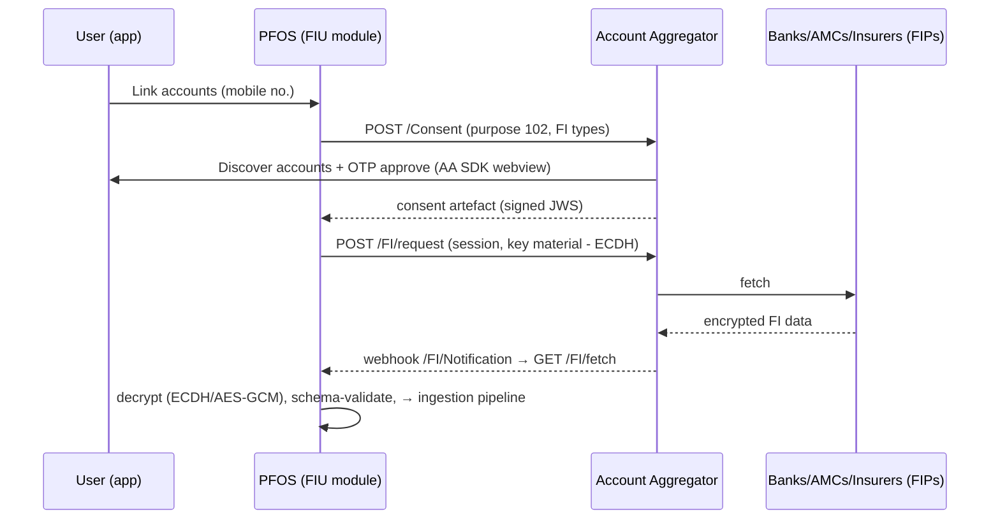

# PFOS — Data Aggregation Architecture

> Deliverable 6. Covers Step 3: every data source, its auth flow, refresh cadence, and the
> ingestion pipeline that turns raw payloads into the canonical model in `03-data-model.md`.

---

## 1. Source Matrix (India)

| # | Source | What we get | API availability | Auth flow | Refresh | Coverage criticality | DQ baseline |
|---|--------|-------------|------------------|-----------|---------|---------------------|-------------|
| 1 | **Account Aggregator** (Finvu / OneMoney / CAMS Finserv / Saafe) | Bank balances + txns, deposits (FD/RD), MF holdings, equities, insurance policies, NPS, GST (where live) | ReBIT FI schemas, prod | AA handle → mobile OTP → consent artefact (purpose 102 PFM) | Daily auto-fetch within consent; event-driven via FI notifications | ★★★★★ backbone | 75 (FIP downtime varies) |
| 2 | **MF Central** (CAMS+KFintech JV) | CAS across both RTAs: folios, txn history, SIPs | Partner API program | PAN + OTP (CASOnline); partner onboarding required | Daily | ★★★★★ for MF depth | 90 |
| 3 | **RTA direct** (CAMS WBR / KFintech) | Same as above, for AMCs distributing via us | Distributor/RIA feeds | ARN/RIA-code based | Daily file drop | ★★★ fallback | 85 |
| 4 | **Credit bureaus** CIBIL, Experian, Equifax, CRIF | Score, tradelines (open+closed loans, cards), utilization, enquiries | Commercial B2B APIs (consumer-consent pull) | Name+PAN+DOB+mobile OTP consent; soft pull | Monthly (score), on-demand refresh | ★★★★ | 95 |
| 5 | **NSDL/CDSL CAS** | Demat holdings incl. bonds, SGB, off-market | e-CAS PDF (monthly email) + CDSL API programs | PAN + DOB parse of e-CAS; or AA equities FI type | Monthly (CAS) / daily (AA) | ★★★ | 80 |
| 6 | **Broker APIs** Zerodha Kite, Upstox, Angel One SmartAPI, Groww, ICICI Direct (Breeze) | Holdings, positions, trade book, P&L | Public dev APIs (per-user app keys vary by broker) | OAuth-style login per broker, daily token expiry (Kite) | Daily on login / on-demand | ★★★ enrichment over CAS | 90 |
| 7 | **EPFO** | PF balance, contributions, passbook | No public API; UAN portal passbook (scrape/parse fragile) + UMANG channel | UAN + OTP | Monthly | ★★★★ (largest hidden asset for salaried) | 60 |
| 8 | **NPS CRAs** (Protean / KFintech / CAMS) | PRAN holdings, scheme NAVs, contributions | Limited partner APIs; AA `NPS` FI type rolling out | PRAN + OTP / AA consent | Weekly | ★★ | 70 |
| 9 | **Insurance** (Bima Central / insurance repositories / AA `INSURANCE_POLICIES`) | Policy list, sum assured, premiums, surrender value | AA FI type live with several insurers; Bima Central emerging | AA consent / policy + OTP | Monthly | ★★★ | 65 |
| 10 | **Vahan (vehicles)** | Registration, make/model/year → depreciation curve | Via licensed API resellers (Surepass/Signzy class) | Reg. number + consent | One-time + yearly | ★ | 70 |
| 11 | **Property** | No registry API; price indices (NHB Residex, private indices) for indexation | Index data public | User enters property; index applied | Quarterly index | ★ | 40 |
| 12 | **Market data** AMFI NAVs, NSE/BSE EOD, IBJA gold, RBI rates, USDINR | Pricing for everything | Public/licensed feeds | Server-to-server | Daily EOD (intraday optional V2) | ★★★★★ | 99 |
| 13 | **US brokers** (for US stocks via INDmoney-style accounts) | Holdings, txns | Per-partner (DriveWealth/Alpaca custodian APIs) | Partner API | Daily | ★ | 90 |
| 14 | **File upload / parse** | CAS PDFs, broker statements, salary slips, Form 16, credit card statements | Internal parser service (LLM + templates) | Upload | On upload | ★★★ cold-start | 70 |
| 15 | **Manual entry** | Anything (jewellery, art, cash, private equity) | — | — | User-prompted revaluation nudges (quarterly) | ★★ completeness | 50 |

**Strategy:** AA is the spine (broadest consented coverage, regulatorily durable). MF Central gives depth for the single biggest retail asset class. Bureau pull is the liabilities spine — it reveals loans the user never connects. Statement parsing is the cold-start bridge so the first-session "aha" never depends on a flaky FIP.

---

## 2. Account Aggregator Integration (detail)

### 2.1 Roles
We register as an **FIU** (Financial Information User) under RBI AA Master Directions — directly (requires regulated-entity status: e.g., SEBI RIA / RBI-regulated partner) or via a TSP (Setu, Finarkein, Cookiejar/FinFactor) in MVP.

### 2.2 Consent design
```
Purpose code: 102 (Personal Finance Management)
FI types:    DEPOSIT, TERM_DEPOSIT, RECURRING_DEPOSIT, SIP, MUTUAL_FUNDS,
             EQUITIES, ETF, BONDS, INSURANCE_POLICIES, NPS, GST (optional)
Fetch type:  PERIODIC, frequency ≤ 1/day
Data range:  rolling 13 months (covers a full FY for tax + trend baselines)
Consent life: 12 months, auto-renewal journey at T-30 days
Data life:   coterminous with consent (purge on expiry/revocation)
```

### 2.3 Flow


### 2.4 Hard-won operational rules
- **FIP health table**: track per-FIP success rate and latency; route user expectations ("HDFC data may take a few hours") and retries (exponential, max 6/day) off it.
- **Partial data is normal**: render per-account freshness, never block dashboard on one FIP.
- **Consent lifecycle jobs**: T-30/T-7 renewal nudges; revocation webhook → purge job → `consent_log`.
- **Dedupe vs other sources**: AA MF data ∩ MF Central data → MF Central wins (richer txns); AA balance remains for cross-check (consistency input to DQ score).

---

## 3. Ingestion Pipeline

```
 Connectors (per source)        Normalize             Resolve & Reconcile          Project
┌──────────────┐   raw    ┌──────────────────┐   ┌────────────────────────┐   ┌─────────────┐
│ aa-connector │ payload  │ schema validate   │   │ entity resolution      │   │ valuation    │
│ mfc-connector│ ───────► │ → canonical DTOs  │──►│ (instrument master,    │──►│ engine,      │
│ bureau-conn. │  (S3,    │ field mapping,    │   │ account matching,      │   │ cashflow     │
│ broker-conn. │  enc.)   │ currency, units   │   │ txn dedupe, transfer   │   │ classifier,  │
│ parser-svc   │          │                   │   │ pairing, idempotency)  │   │ insights     │
└──────────────┘          └──────────────────┘   └────────────────────────┘   └─────────────┘
        each stage emits events on the bus (Kafka/Redpanda): raw.received → dto.normalized
        → ledger.updated → valuation.updated → insights.refresh
```

**Stage contracts**

1. **Connectors** — one stateless service per provider; output = raw payload to encrypted object store + `raw.received` event. Retries, circuit breakers, FIP health metrics live here.
2. **Normalizer** — provider-specific mappers → canonical DTOs (`AccountDTO`, `PositionDTO`, `TransactionDTO`, `PolicyDTO`). Version every mapper; replayable from raw store (reprocessing = re-emit, ledger is idempotent).
3. **Resolver** — the hard part:
   - *Instrument resolution*: ISIN/AMFI-code lookup → instrument master; fuzzy name match queue for unmatched (human-in-loop console).
   - *Account matching*: (provider, external_id) exact; cross-provider heuristic (same FD seen via AA and bank statement) flagged for user confirm.
   - *Transaction dedupe*: hash(account, date, amount, narration-stem) within ±2 days window.
   - *Internal transfer pairing*: opposite-sign equal-amount within 3 days across own accounts → `transfer`, excluded from income/expense (the #1 source of inflated spend numbers in naive PFMs).
4. **Projectors** — recompute positions, daily `account_valuation`, materialized views; emit `valuation.updated` which triggers insight re-evaluation for affected persons only.

**Categorization service** (expenses): 3-tier — (1) user rules, (2) merchant dictionary (UPI VPA/MCC/narration patterns, India-specific: Swiggy/Zomato/IRCTC/Jio…), (3) ML fallback (fine-tuned small model on narration → category, target ≥92% precision on top-9 categories). Every user correction writes a rule and a training example.

---

## 4. Refresh Orchestration

| Tier | Sources | Schedule |
|---|---|---|
| Nightly batch (01:00–06:00 IST) | AA periodic fetch, NAV/price loads, valuations, MVs, health score, insights | Temporal cron workflows |
| Event-driven | AA FI notifications, broker postback, file upload | immediate |
| On-demand | "Refresh now" (rate-limited 3/day/connection), bureau refresh (monthly cap) | user-triggered |
| Slow loop | EPFO (monthly), property index (quarterly), revaluation nudges | scheduled |

Orchestrator: **Temporal** — durable retries across multi-hour AA fetch sessions, per-connection workflow state, human-visible run history (debuggability is the product here).

---

## 5. Global/abstraction note
The connector interface (`discover() → consent() → fetch() → normalize()`) is provider-agnostic; adding Plaid/MX later for NRI/US accounts is a new connector, not a new architecture.
