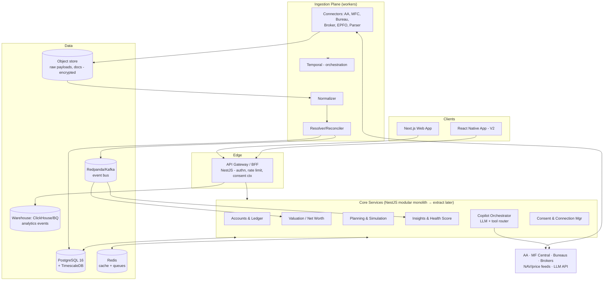

# PFOS — Technical Architecture

> Deliverables 5 (API Architecture) + 11 (Technical Architecture Diagrams) + Step 10.

---

## 1. System Overview



**Shape decision:** modular monolith (NestJS modules with enforced boundaries) + separate worker deployment for ingestion. Microservices day-one is wrong for a 6–10 engineer team; the event bus + module boundaries keep extraction cheap when scale demands (connectors extract first — they're already stateless).

**Stack** (per Step 10, confirmed): Next.js 15 + React + TypeScript + Tailwind (web); NestJS + TypeScript (API/workers); PostgreSQL 16 + TimescaleDB; Redis (cache, rate limits, BullMQ for light jobs); Temporal (long-running fetch workflows); Redpanda (events); shared `@pfos/engines` TS package (see 05); LLM = Claude API behind an internal gateway (logging, budgets, prompt registry).

---

## 2. API Architecture

Style: REST + JSON, versioned `/v1`, OpenAPI-first (generated client SDKs); cursor pagination; idempotency keys on all POSTs; field-level `freshness`/`confidence` metadata on financial reads. WebSocket/SSE channel for fetch-progress and copilot streaming.

```
AUTH      POST /v1/auth/otp | /verify | /refresh        (phone/email OTP + optional TOTP)
PROFILE   GET/PATCH /v1/me · /v1/family · POST /v1/family/members
CONNECT   POST /v1/connections {provider}               → consent journey descriptor
          GET  /v1/connections · POST /:id/refresh · DELETE /:id (revoke+purge)
          POST /v1/connections/aa/callback              (AA webhooks)
ACCOUNTS  GET /v1/accounts?class=&type=&person=
          POST /v1/accounts (manual) · PATCH /:id · POST /v1/documents (upload→parse)
NETWORTH  GET /v1/networth?scope=family&granularity=daily&from=&to=
          GET /v1/networth/allocation?xray=true · GET /v1/networth/attribution?month=
HOLDINGS  GET /v1/holdings?groupBy=class · GET /v1/holdings/:id/returns
LIAB      GET /v1/liabilities · GET /:id/amortization · POST /:id/simulate-prepayment
CASHFLOW  GET /v1/cashflow/summary?month= · GET /v1/transactions?category=&q=
          PATCH /v1/transactions/:id {category} · GET/POST /v1/cashflow/rules
          GET /v1/cashflow/recurring · GET /v1/obligations/upcoming
GOALS     CRUD /v1/goals · POST /v1/goals/:id/accounts · GET /v1/goals/:id/projection
PLAN      GET /v1/retirement · GET /v1/fire · POST /v1/simulations {kind, deltas}
          POST /v1/purchase-advisor {type, price, funding}
INSIGHTS  GET /v1/insights?status=open · POST /:id/act|snooze|dismiss
SCORE     GET /v1/health-score?history=12m
CREDIT    POST /v1/credit/pull {bureau} · GET /v1/credit/latest
COPILOT   POST /v1/copilot/chat (SSE) · GET /v1/copilot/brief/today
PRIVACY   POST /v1/me/export · POST /v1/me/erase · GET /v1/consents/log
```
AuthZ: scope claims (`family:{id}:read`, role-based for couple/family-office/advisor seats); every handler resolves through a policy layer (person→family RLS mirrors DB).

---

## 3. Security & Compliance Architecture (Step 10)

| Layer | Controls |
|---|---|
| Transport | TLS 1.3 everywhere; mTLS to AA/partner endpoints; cert pinning in mobile |
| At rest | AES-256 (RDS/KMS); separate KMS keys per data class; raw FI payloads envelope-encrypted per connection (crypto-shred on revocation = delete key) |
| PII | Vault tokenization service for PAN/phone/account numbers; app DB stores tokens; detokenization audited + role-gated |
| AA compliance | RBI AA Master Direction: consent artefact validation (JWS), purpose limitation enforced in code (PFM data never reaches marketing systems), data-life = consent-life purge jobs, FIU audit reports |
| DPDP Act | Notice & consent records (`consent_log`), purpose-tagged data classes, export/erasure APIs with SLA, breach-notification runbook, Data Protection Officer process |
| SEBI posture | Insight taxonomy gating (06 §1); if/when RIA: suitability records, advice audit trail, advertisement code review for all Class A templates |
| AppSec | OWASP ASVS L2 target; SAST/DAST + dependency scanning in CI; secrets in KMS/SSM; quarterly pentest; bug bounty at GA |
| Access | SSO + hardware MFA for staff; production access via short-lived credentials + session recording; support views are masked-by-default |
| Audit | Append-only `audit_log` → WORM bucket; consent events immutable |
| Resilience | Multi-AZ Postgres + PITR; RPO ≤ 5min, RTO ≤ 1h; chaos drills on FIP outage scenarios; DR region (data residency: all user data in India region) |
| App | Device binding, biometric lock, privacy-blur, jailbreak/root detection (mobile), no screenshots of sensitive screens (Android flag) |

Threat model headline risks: aggregated-credential honeypot (mitigated: AA model means we never hold bank credentials; broker tokens encrypted, short-lived), insider access (masking + audit), LLM prompt-injection via transaction narrations/document uploads (sanitize tool inputs, never let document text reach system-prompt level, output validator).

---

## 4. Analytics & Observability

- **Product analytics**: event taxonomy (`onboarding_step_completed`, `connection_linked {provider}`, `first_networth_rendered {ttv_seconds}`, `insight_acted {rule_code, impact}`, `simulation_run`, `brief_opened`...) → Kafka → warehouse; dashboards for activation funnel, TTV, insight act-rate, WAU/MAU, connection health by FIP. (Mixpanel/PostHog acceptable; warehouse is source of truth.)
- **Ops**: OpenTelemetry traces gateway→engines; per-connector success/latency SLOs (AA fetch p95 < 4min, alert < 80% daily success per major FIP); ledger reconciliation residual alert (05 §10); LLM cost/latency/refusal-rate dashboards.
- **Data quality**: per-connection DQ score trend (03 §7); golden-user synthetic accounts fetched nightly to catch silent provider format changes.

---

## 5. Environments & Delivery

Envs: dev → staging (AA sandbox/UAT FIPs, bureau test creds) → prod (India region). CI: typecheck, unit (engines golden tests), contract tests per connector against recorded fixtures, e2e (Playwright) on onboarding + dashboard; canary deploys; feature flags (insight rules individually flagged). Infra: AWS (ap-south-1), Terraform, EKS or ECS; Postgres RDS; everything reproducible from code.

Team shape to build MVP (reference): 2 FE, 3 BE (1 owning ingestion), 1 data/ML, 1 design, 1 PM, fractional compliance counsel + security.
